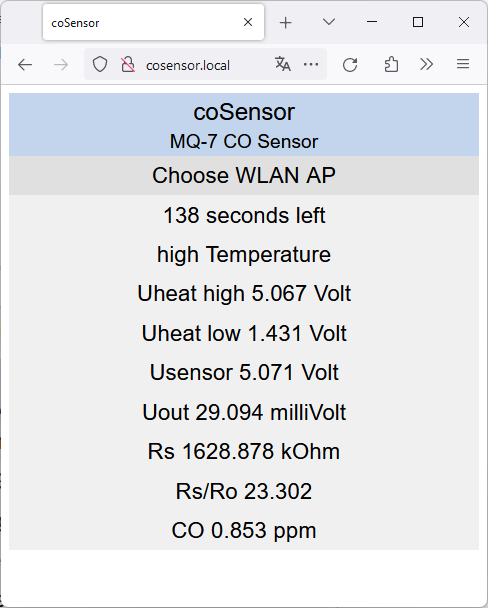

# coSensor
ESP32 based MQ-7 CO Sensor
#### Features
* uses MQ-7 CO Sensor
* controllable via WebUI
* works as WLAN client and AP (AP chooser included)
* WebUI with IP address 192.168.4.1
* mDNS hostname cosensor.local
* DNS hostname cosensor.local (WLAN AP mode only)
#### GPIO ADS1115 (I2C)
* GPIO 21 - SDA
* GPIO 22 - SCL
#### GPIO MQ-7
* GPIO 25 - heater control
#### Documentation
* [MQ-7 Datasheet](documentation/MQ-7.pdf)
* [MQ-7 Calculations](documentation/mq-7.ods)
#### Web UI

#### Schematic
